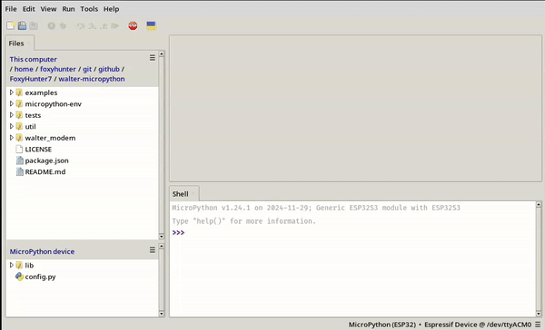

# Minimal Unittest

This is a minimal unit-test implimentation tailored for micropython.
It includes all the standard asserts and measures how long each assert took.

## Setup

### Using `mpremote`

Copy `minimal_unittest.py` to `/lib/minimal_unittest/__init__.py` on the
Micropython device.

```sh
mpremote mkdir :lib # Make the lib dir on the MicroPython device if not already
mpremote mkdir :lib/minimal_unittest
mpremote cp tests/minimal_unittest.py :lib/minimal_unittest/__init__.py
```

Then run the tests on the device.

```sh
mpremote run tests/test_unittest.py
```

> [!NOTE]
> When no device is specified mpremote takes the first available device,
> the above example leverage that.

### Using `Thonny`

Place `minimal_unittest.py` in `:lib/minimal_unittest` as `__init__.py`
on the Micropython device.




## Usage

This uses the principle of test-cases; a class in which several tests are grouped.
Simply inherit from `TestCase`, prefix the test methods with "test_"
and call the `run()` method to run all tests.

Every test method should have 1 assert call.

```py
import minimal_unittest as unittest

class TestExample(unittest.TestCase):
    def test_example(self):
        # ...
        self.assert_is_not_none(var)

test_example = TestExample()
test_example.run()
```

> [!TIP]
> `TestCase` only support synchronous methods,
> to work with asynchronous methods inherit from `AsyncTestCase` instead.

## Asserts

The supported assert methods are as follows:

### Assert Equal

Asserts the two given arguments are equal.

```py
self.assert_equal('A', 'A')
```

### Assert Not Equal

Asserts the two given arguments are not equal.

```py
self.assert_not_equal('a', 'A')
```

### Assert True

Asserts the given argument evaluates truthy.

```py
self.assert_true('FOO'.isupper())
```

### Assert False

Asserts the given argument evaluates falsy.

```py
self.assert_false('Foo'.isupper())
```

### Assert Is

Assert the two given arguments are the same *(memory reference)*.

> [!WARNING]
> MicroPython, like CPython, may intern small integers and short strings for efficiency.
> This means that seemingly distinct objects might reference the same memory location:
> ```py
> a = 42
> b = 42
> assert_is(a, b)  # May pass unexpectedly
> ```
> This optimisation varies by implementation and can cause unexpected results with `is`.
> For reliable equality checks, use `==`/`Assert Equal` unless object identity is necessary.

```py
l = [1, 2, 3]
n = l[0]
self.assert_is(l[0], n)
```

### Assert Is Not

Assert the two given arguments are not the same *(memory reference)*.

> [!WARNING]
> The same warning stated above, for `Assert Is`, also applies here.\
> For reliable equality checks, use `!=`/`Assert Not Equal`
> unless object identity is necessary.

```py
self.assert_is_not([1], [1])
```

### Assert Is None

Assert the given argument is `None`.

```py
self.assert_is_none(None)
```

### Assert Is Not None

Assert the given argument is not `None`.

```py
self.assert_is_not_none('a')
```

### Assert In

Assert the first argument is in or part of the second argument.

```py
l = [1, 2, 3]
self.assert_in(2, l)
```

### Assert Not In

Assert the first argument is not in or part of the second argument.

```py
l = [1, 2, 3]
self.assert_not_in(4, l)
```

### Assert Is Instance

Asserts the first argument is an instance of second argument

> [!NOTE]
> The second argument can be a tuple of types,
> eg. `(str, int)` if something may be a string or int to pass

```py
self.assert_is_instance('a', str)
```

### Assert Not Is Instance

Asserts the first argument is not an instance of second argument

> [!NOTE]
> The second argument can be a tuple of types,
> eg. `(str, int)` if something may not be a string or int to pass

```py
self.assert_is_instance(4, str)
```

### Assert Does Not Throw

Asserts the callable *(first argument)*does not throw set exception(s) *(second argument)*

> [!NOTE]
> After arg1 & arg2, all additional provided arguments
> are passed onto the callable *(arg1)*.

```py
self.assert_does_not_throw(self.sum, Exception, 1, 2)
```

## WalterModemAsserts

These are asserts specific to the micropython waltermodem implimentation,
made to reduce repetitive code and risk of errors whilst writing tests.

> [!NOTE]
> These can only be used inside of an [`AynscTestCase`](#usage)
> as these asserts mut be awaited.

To use these, also inherit from WalterModemAsserts.

```py
import minimal_unittest as unittest

class TestExample(unittest.TestCase, unittest.WalterModemAsserts):
    # ...
```

### Assert Sends AT Command

Asserts a given modem method sents the correct AT command to the modem.

```py
await self.assert_sends_at_command(
    modem_instance=modem,
    expected_cmd='AT+CEREG=1',
    method=lambda: modem.config_cereg_reports(WalterModemCEREGReportsType.ENABLED)
)
```

> [!NOTE]
> The expected_cmd can also be a tuple of expected_cmds *(strs)*.

Optionally you can also provide: `at_rsp_pattern` should it differ from `b'OK'`
and/or `timeout_s` should you want to wait longer than 5 seconds before timing out.
